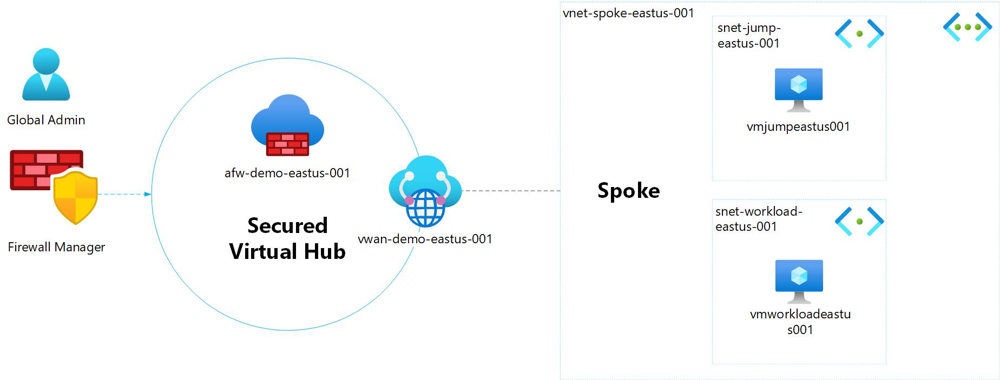

# Azure Firewall Manager Demo

Simple demo to showcase the Azure Firewall Manager

# Architecture Overview



# Deploy

Source: [Microsoft Learn](https://learn.microsoft.com/en-us/azure/firewall-manager/quick-secure-virtual-hub-bicep?tabs=CLI)

## CLI

### Create Resource Group

```
az group create --name afm-demo-rg --location westeurope
```

### Deploy

```
az deployment group create --resource-group afm-demo-rg --template-file afm-demo.bicep --parameterfile afm-demo-parameters.json
```
