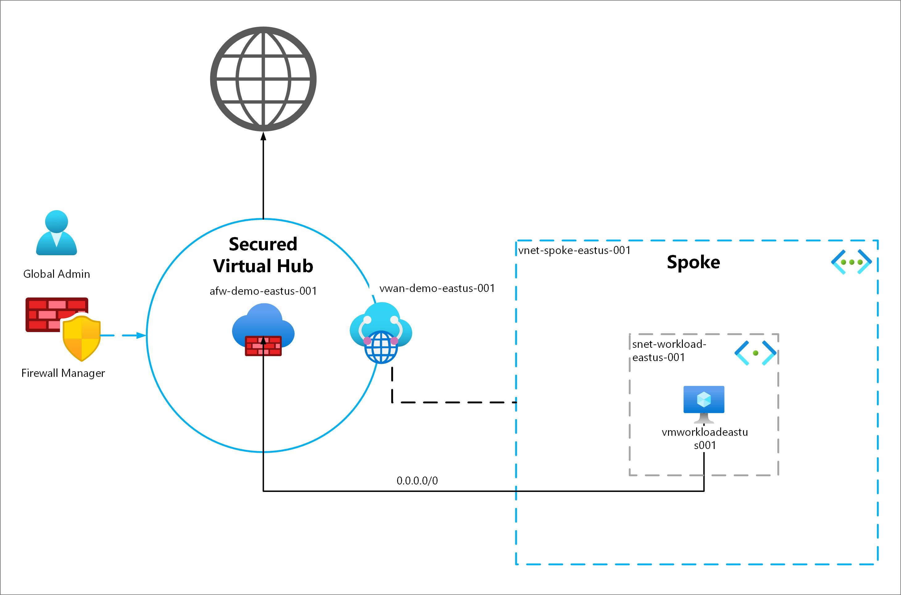

# Azure Firewall Manager Demo

Simple demo to showcase the Azure Firewall Manager

# Architecture Overview



# Deploy

Source: [Microsoft Learn](https://learn.microsoft.com/en-us/azure/firewall-manager/quick-secure-virtual-hub-bicep?tabs=CLI)

## CLI

### Create Resource Group

```
az group create --name rg-afm-demo-001 --location westeurope
```

### Deploy

```
az deployment group create -n az-afm-demo --resource-group rg-afm-demo-001 --template-file main.bicep --parameters adminPassword=AdminPassword123!
```

### Cleanup Resource Group

```
az group delete --name rg-afm-demo-001 --yes
```
