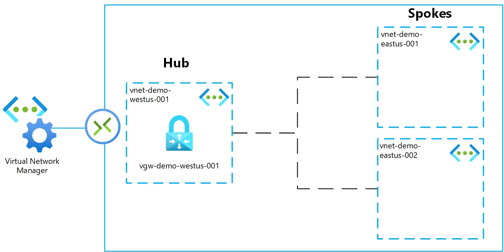

# Azure Virtual Network Manager

Simple demo to showcase the Azure Virtual Network Manager

# Architecture Overview



# Deploy

Source: [Microsoft Learn](https://learn.microsoft.com/en-us/azure/virtual-network-manager/tutorial-create-secured-hub-and-spoke)

## CLI

### Create Resource Group

```
az group create --name rg-avnm-demo-001 --location westeurope
```

### Deploy

```
az deployment group create -n az-avnm-demo --resource-group rg-avnm-demo-001 --template-file main.bicep --parameters adminPassword=AdminPassword123!
```

### Cleanup Resource Group

```
az group delete --name rg-avnm-demo-001 --yes
```