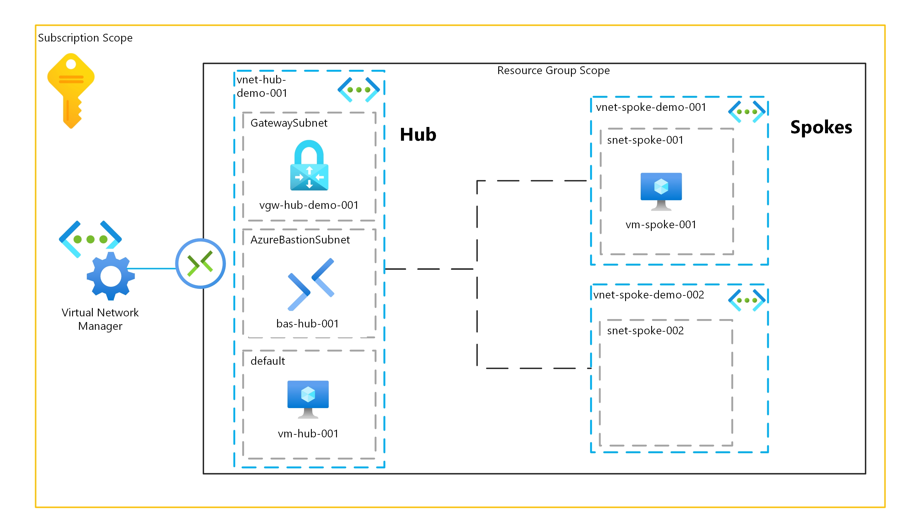

# Azure Virtual Network Manager

Simple demo to showcase the Azure Virtual Network Manager

# Architecture Overview



# Deploy

Source: [Microsoft Learn](https://learn.microsoft.com/en-us/azure/virtual-network-manager/tutorial-create-secured-hub-and-spoke)

## CLI

### Create Resource Group

```
az group create --name avnm-demo-rg --location westeurope
```

### Deploy

```
az deployment group create --resource-group avmm-demo-rg --template-file avnm-demo.bicep --parameterfile avmm-demo-parameters.json
```
